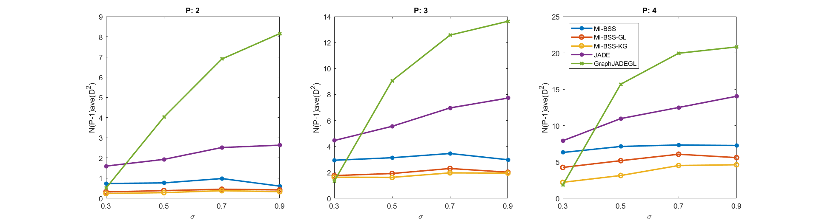
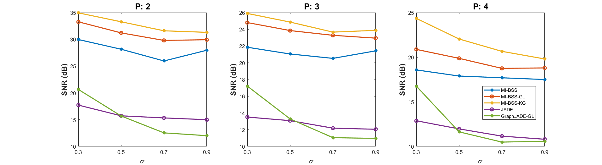
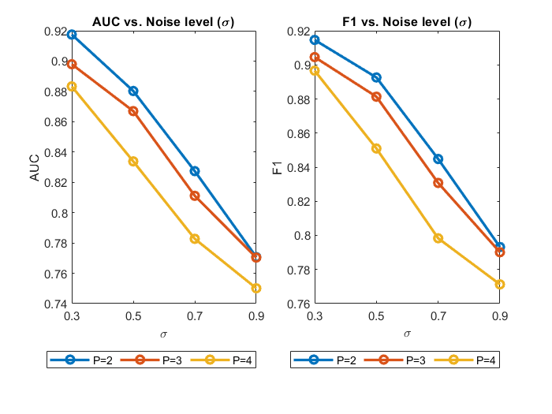

# MI-BSS-GL: Joint Graph Learning and Blind Separation of Smooth Graph Signals
This repository implements a demo for **Joint Graph Learning and Blind Separation of Smooth Graph Signals Using Minimization of Mutual Information and Laplacian Quadratic Forms** using the proposed **MI-BSS-GL** method, similar to the Figures 1 and 2 in our paper [1]. In the case of finding its contents useful for your research work, kindly please cite our paper [1] addressed below. Thanks a lot for your attention.

[[1] Einizade, Aref, and Sepideh Hajipour Sardouie. "Joint Graph Learning and Blind Separation of Smooth Graph Signals Using Minimization of Mutual Information and Laplacian Quadratic Forms." IEEE Transactions on Signal and Information Processing over Networks 9 (2023): 35-47.](https://doi.org/10.1109/TSIPN.2023.3240893)

The codes were written in MATLAB 2018b, and the [GSPBOX](https://epfl-lts2.github.io/gspbox-html/) and [UNLocBoX](https://epfl-lts2.github.io/unlocbox-html/) toolboxes are also needed to run this demo.

- Run `Demo_MI_BSS_GL.m` to generate the desired results. 

Note that we have used an accelarted graph learning method for learning the underlying graph proposed in [this paper](https://doi.org/10.1109/LSP.2021.3123459). Besides, in the comparisons, we used an implementation of the JADE method released [here](http://www2.iap.fr/users/cardoso/code/Jade/jadeR.m).

  

Thanks a lot for your attention.
